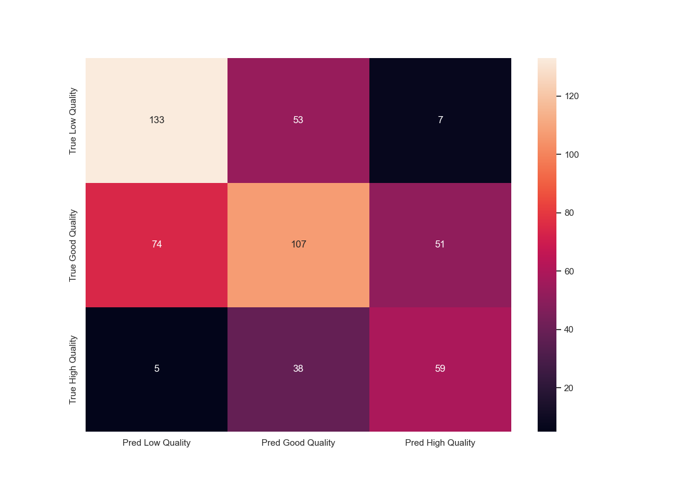

# ID2223 Lab1
## EDA and feature engineering/pruning

The Wine Quality dataset has around 5000 entries with 12 different features and an assigned quality to each wine. The data is heavily skewed toward qualities between 5-7, while there are only a few entries for qualities between 0-4 and 8-10. This made it necessary to re-group the wine into new categories. For our purpose we used groups of Low Quality (0-5), Good Quality (6) and High Quality (7-10), which resulted in groups that was a lot less skewed. This allowed us to simply drop any entries with invalid data, as there was only 10 such entries.

The approach we took for feature engineering was simple. We wanted as few features as possible, while still gaining good performance so that it would be easy to interact with the wine quality assessment model later on. This was done by viewing the distribution of the feature for the three different group, while also looking at the sample- mean and standard deviation for each feature under each group. Features that had a sampled mean that barely changed between the quality groups, and that had a high sample standard deviation in comparison to the change in sample mean between groups were considered for removal. For removal, the feature distribution was considered more carefully. Features that had distributions that had little to no change in distribution between quality groups were removed, this ended up being the sulphates, pH and residual sugar features.

Finally, to remove a few additional features the correlation matrix was considered. Features that correlated highly and/or had a low correlation with quality was consdidered for removal. For this step we removed free sulfur dioxide since it correlated highty with total sulfur dioxide, and had low correlation with quality. Furthermore, we also removed fixed acidity since it correlated a bit with colatile acidity and had little correlation with quality. These features were fully removed after considering their distributions between quality groups again. This resulted in 7 remaining features to train the model with.
Lastly, we constructed violin plots to get a better idea of the distributions of the chosen variables, which would come in handy when creating the wine simulation.

## Wine Simulation
The wine simulation was simply constructed by viewing the sample- mean and standard deviation for the chosen features and creating a gaussian distribution using these parameters. This worked fairly well since most of the features already had a gaussian distribution. However, some of the features had multi modal gaussian distributions. This was not considered in the simulation as it seemed that the gaussian approximation worked well enough for the most important features. This resulted in a fairly accurate wine simulations with a few caveats, since we didn't consider modeling conditional distributions!

## Model choice and performance
For models we considered a simple deep neural network, a gradient boosting classifier and a random forest. In the end we went with the deep neural network since it had pretty good performance, but in the end most models performed equivalently. The deep neural network was trained with a 90-10% train test split, since we did not have a lot of data to begin with. The network consists of 4 layers of dense layers with a width of 256 and the Scaled Exponential Linear Unit as activation function, each layer is followed by a batch normalization layer. The last two layers are simply a normal dense layer as before followed by the output layer with a width of 3 and the softmax activation function. The model was trained with class weight such that each class was valued evenly, if this was not done the model would tend to only guess a single wine quality all the time. The model was trained for 150 epochs with a lower learning rate (0.00025) to increase stability, the resulting model had a train accuracy of ~58% and a test accuracy of about ~56% which is alright considering the class weighting. The final confusion matrix is given by:

## Batch inference
This remained very close to the original file from the iris example code. It simply loads and predicts the last added wine from the wine dataset. This wine most likely comes from the wine simulation as it inserts the generated wine into the training dataset. The predicted wine is added to the history of predictions and an image of the last 8 predictions is created, the image contains information on the prediction, true label and date of the prediction. Finally, the history of all predictions is used to create a confusion matrix. The history of predictions, prediction image and confusion matrix is uploaded to hopsworks for use in the apps.

## Apps: Wine predictor and monitor.

The apps are very similar to the original iris predictor and monitor. The predictor interface simply takes the features of a wine as input and makes the trained model predict what quality wine it is. It displays the complete output, including how confident the model is in its prediction. The app is currently hosted on hugging face: [Wine quality prediction app](https://huggingface.co/spaces/carlpersson/WineQuality)

The wine monitor app uses the prediction history, the image of the prediction history and the confusion matrix as outputted by the batch inference pipeline that runs daily. The app specifically displays the details of the last prediction and the images. The app is hosted on hugging face and can be seen here: [Wine monitor app](https://huggingface.co/spaces/carlpersson/WineMonitor)

